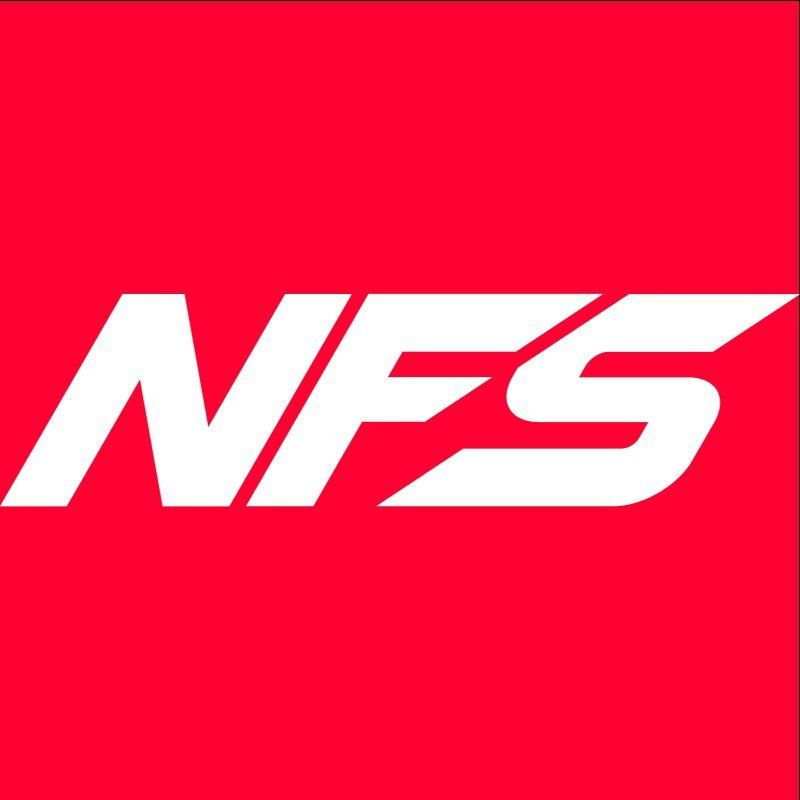
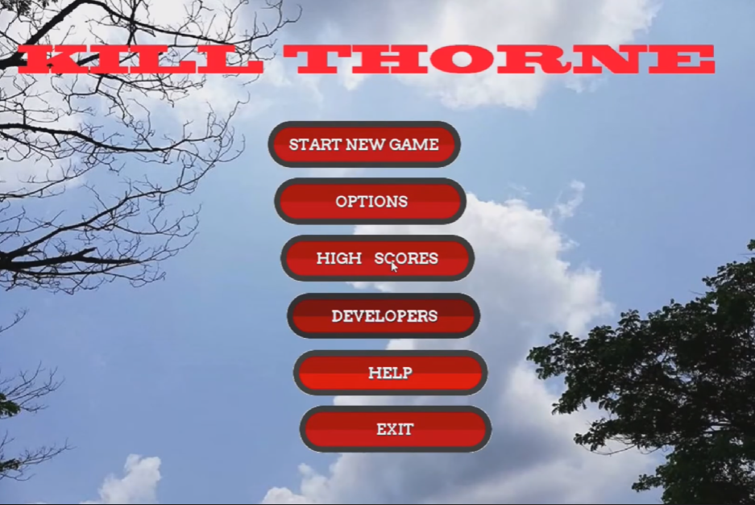
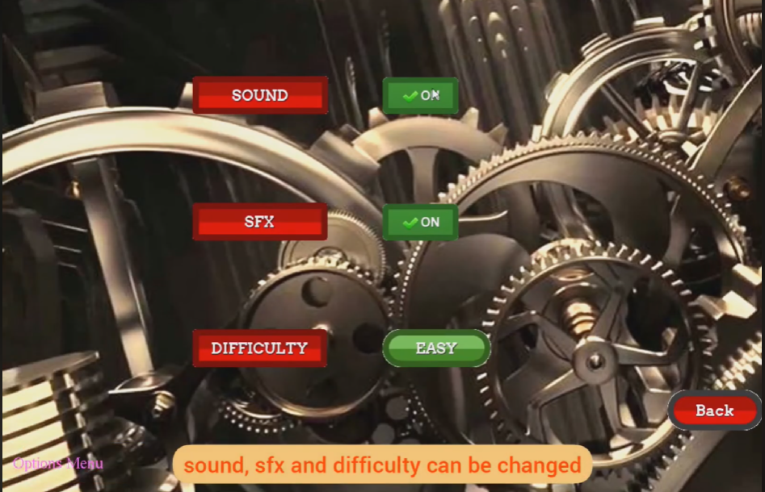
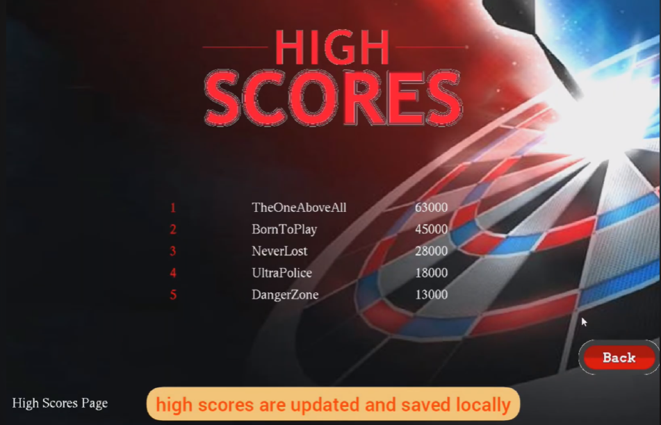
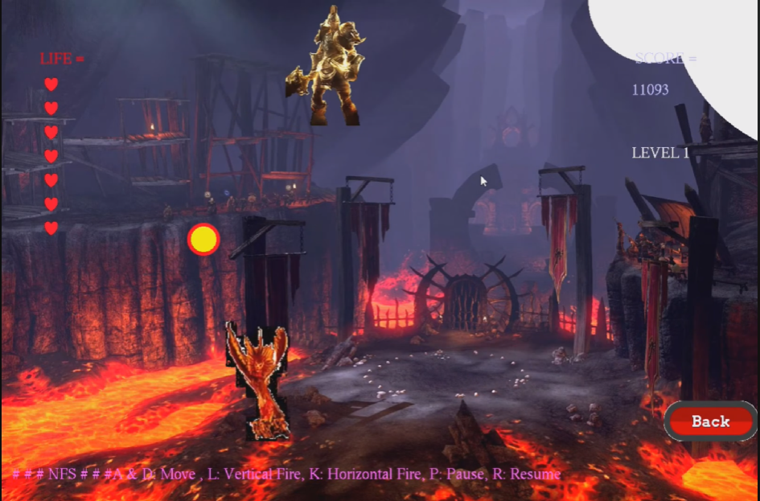

<a name="readme-top"></a>

<!-- PROJECT SHIELDS -->

[![Contributors][contributors-shield]][contributors-url]
[![Stargazers][stars-shield]][stars-url]
[![LinkedIn][linkedin-shield]][linkedin-url]


<!-- PROJECT LOGO -->
<br />
<div align="center">
  <a href="https://github.com/mrmajumder/GAME-KILLERS-NFS">
    
  </a>

<h3 align="center">Kill Thorne</h3>

  <p align="center">
    A C-based Shooting Game
    <br />
    <br />
  </p>
</div>


<!-- TABLE OF CONTENTS -->
<details>
  <summary>Table of Contents</summary>
  <ol>
    <li>
      <a href="#about-the-project">About The Project</a>
      <ul>
        <li><a href="#built-with">Built With</a></li>
        <li><a href="#project-images">Project Images</a></li>
      </ul>
    </li>
    <li>
      <a href="#getting-started">Getting Started</a>
      <ul>
        <li><a href="#prerequisites">Prerequisites</a></li>
        <li><a href="#installation">Installation</a></li>
      </ul>
    </li>
    <li><a href="#contributors">Contributors</a></li>
    <li><a href="#acknowledgments">Acknowledgments</a></li>
  </ol>
</details>


<!-- ABOUT THE PROJECT -->
## About The Project

**Kill Thorne** has been submitted as the final project for the course "CSE 102: Structured Programming Language Sessional". The project is a C-based graphics game that uses the custom graphics library "iGraphics", featuring 2D level based environment and simple controls and shooting to clear levels, and boss at the end.

The project is mainly made with C (programming language) and "iGraphics" used for graphics and rendering. The graphics library being custom made and lacking many features, all the projects were really laggy and slow, still we managed to pull off a moderately good experience for the user.

<p align="right">(<a href="#readme-top">back to top</a>)</p>


### Built With

[![C language][C_img]][c_url]

<p align="right">(<a href="#readme-top">back to top</a>)</p>

### Project Images
<p float="left" align="middle">
  
   
  
   
</p>

<p align="right">(<a href="#readme-top">back to top</a>)</p>


<!-- GETTING STARTED -->
## Getting Started

Here's how you can run the game locally in your pc. 

### Prerequisites

This is a list of things you need to use the software and how to install them.

  ```sh
  need gcc or g++
  ```

### Installation


1. Clone the repo
   ```sh
   git clone https://github.com/mrmajumder/GAME-KILLERS-NFS.git
   ```
2. Click on the `KILL THORNE.exe` to run the program.

<p align="right">(<a href="#readme-top">back to top</a>)</p>


<!-- CONTRIBUTING -->
## Contributors

* Shafayat Hossain Majumder - [GitHub][github-url] | [LinkedIn][linkedin-url] | [Mail][email] | [Website][website-url]
* Fahmid Al Rifat - [GitHub](https://github.com/FahmidAR) | [LinkedIn](https://www.linkedin.com/in/fahmid-al-rifat-626816152/) | [Mail](alrifatfahmid2@gmail.com) | [Website](https://fahmidar.github.io/)
* Noshin Ulfat - [GitHub](https://github.com/NoshinUlfat) | [LinkedIn](https://www.linkedin.com/in/noshin-ulfat-abb555256/) | [Mail](ulfat.noshin.007@gmail.com)


<p align="right">(<a href="#readme-top">back to top</a>)</p>

<!-- ACKNOWLEDGMENTS -->
## Acknowledgments

* [Dr. Md. Shohrab Hossain](http://mshohrabhossain.buet.ac.bd/) - Supervised the project.


<p align="right">(<a href="#readme-top">back to top</a>)</p>


<!-- MARKDOWN LINKS & IMAGES -->
<!-- https://www.markdownguide.org/basic-syntax/#reference-style-links -->
[contributors-shield]: https://img.shields.io/github/contributors/mrmajumder/GAME-KILLERS-NFS.svg?style=for-the-badge
[contributors-url]: https://github.com/mrmajumder/GAME-KILLERS-NFS/graphs/contributors
[forks-shield]: https://img.shields.io/github/forks/mrmajumder/GAME-KILLERS-NFS.svg?style=for-the-badge
[forks-url]: https://github.com/mrmajumder/GAME-KILLERS-NFS/network/members
[stars-shield]: https://img.shields.io/github/stars/mrmajumder/GAME-KILLERS-NFS.svg?style=for-the-badge
[stars-url]: https://github.com/mrmajumder/GAME-KILLERS-NFS/stargazers
[issues-shield]: https://img.shields.io/github/issues/mrmajumder/GAME-KILLERS-NFS.svg?style=for-the-badge
[issues-url]: https://github.com/mrmajumder/GAME-KILLERS-NFS/issues
[license-shield]: https://img.shields.io/github/license/mrmajumder/GAME-KILLERS-NFS.svg?style=for-the-badge
[license-url]: https://github.com/mrmajumder/GAME-KILLERS-NFS/blob/master/LICENSE.txt
[linkedin-shield]: https://img.shields.io/badge/-LinkedIn-black.svg?style=for-the-badge&logo=linkedin&colorB=555
[linkedin-url]: https://linkedin.com/in/monsieurmajumder
[github-url]: https://github.com/MrMajumder/
[email]: monsieurmajumder@gmail.com
[website-url]: https://mrmajumder.github.io/
[C_img]: https://img.shields.io/badge/C-A8B9CC?style=for-the-badge&logo=c&logoColor=white
[c_url]: https://en.wikipedia.org/wiki/C_(programming_language)